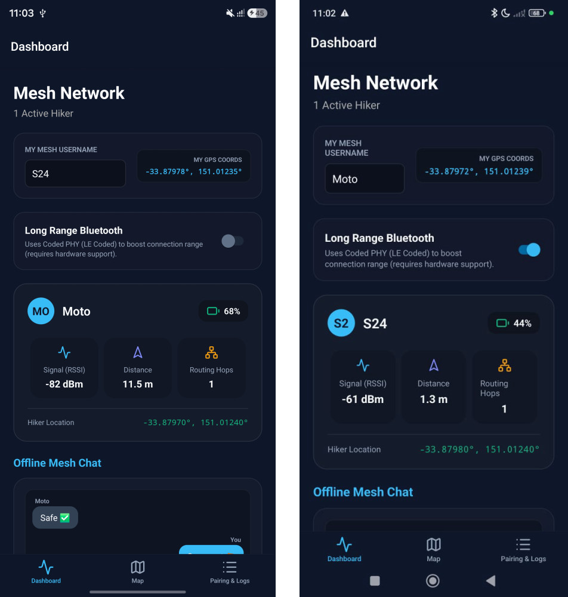
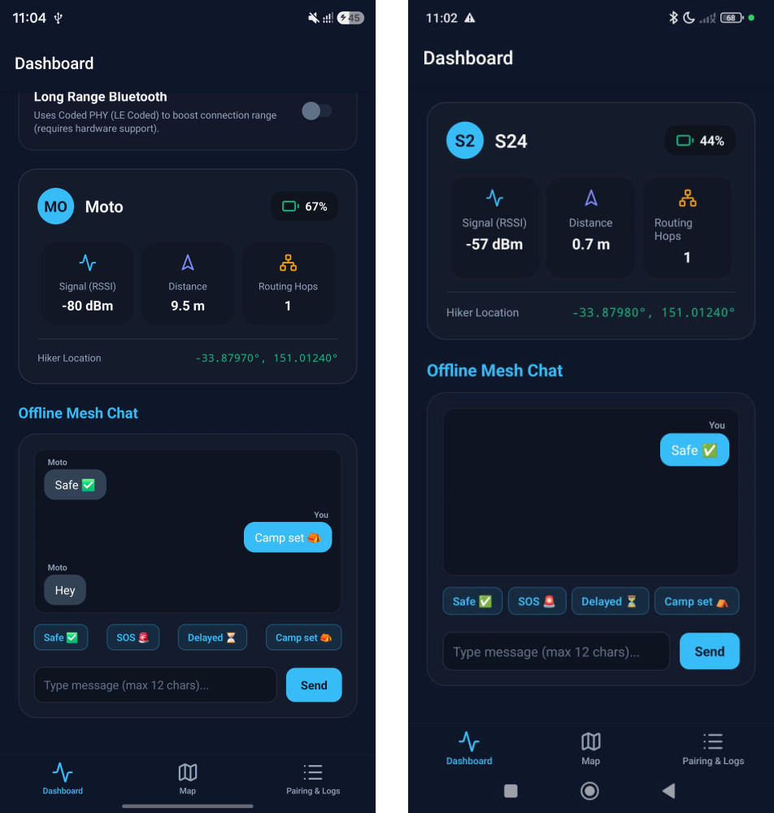
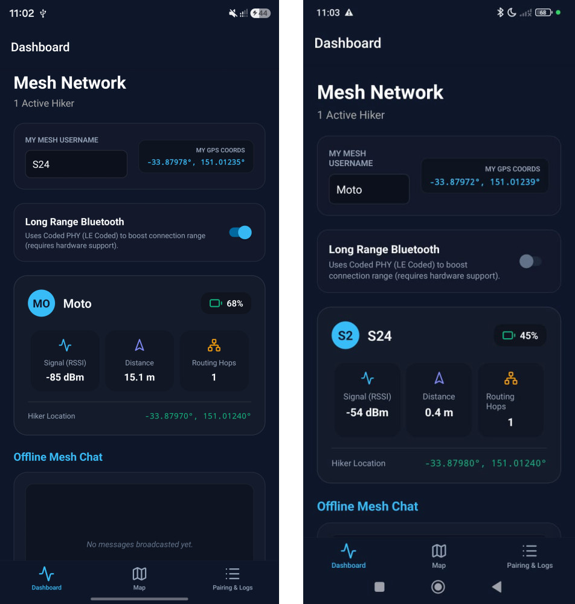
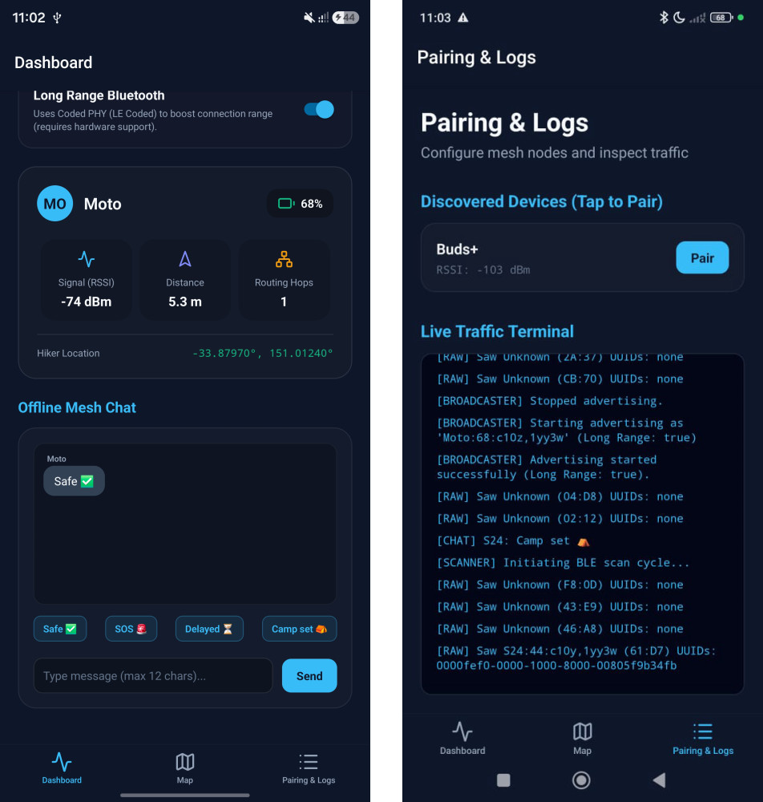
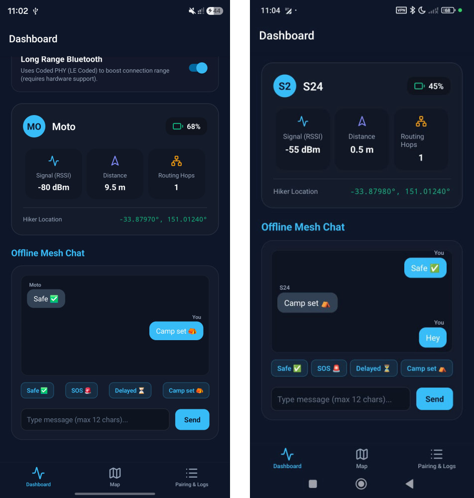
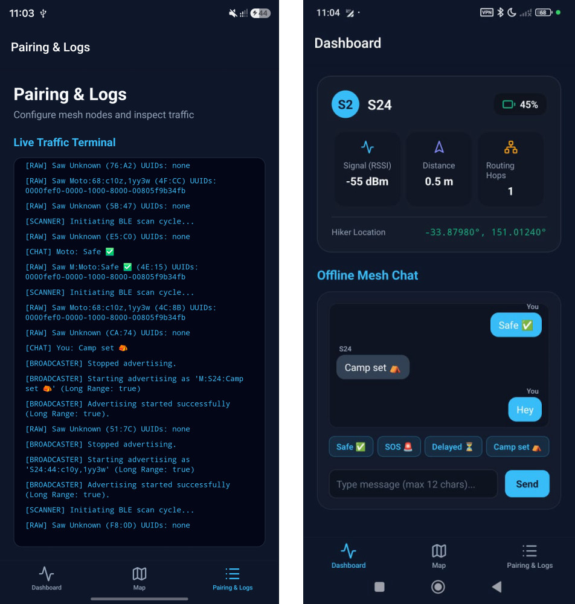

# MeshMap 🛰️ - Off-Grid P2P Tactical Mapping & Messaging

MeshMap is a decentralized, infrastructure-free, connectionless peer-to-peer (P2P) mapping and messaging system designed for deep-wilderness, disaster-struck, and tactically compromised environments. 

By leveraging raw Bluetooth Low Energy (BLE) advertisements, MeshMap enables devices to broadcast and discover location telemetry, battery levels, and short chat messages asynchronously—without requiring internet connectivity, cellular networks, or establishing active Bluetooth pairings/handshakes.

---

## 📸 Cross-Device Demonstration (S24 vs Motorola)

<p align="center">
  
  
  
  
  
  
</p>

---

## 🛠️ Tech Stack

- **Frontend Core**: React Native (Expo SDK 56) with Expo Router for file-based navigation.
- **Styling**: TailwindCSS via NativeWind with a high-performance dark-mode tactical glassmorphic UI.
- **Mapping Engine**: SVG-based dynamic GPS projection projecting decimal degrees directly into scaled map pixels locally.
- **Native Android Layer (Kotlin)**: Custom BLE peripheral GATT server manager supporting concurrent multi-advertising slots.
- **Native Android Scanner (Java)**: Direct hardware `BluetoothLeScanner` interface with runtime Reflection to bypass RxAndroidBle/Plx constraints and force radio scanning across all physical layers (including Coded PHY).

---

## ⚡ How it Works (Under the Hood)

### 1. Connectionless, Stateless P2P Protocol
Instead of establishing classical BLE client-server connection handshakes (which are power-heavy, slow, and capped at 7 concurrent links), MeshMap uses **stateless BLE advertising**. Devices continuously shout their identity and metrics into the ambient airwaves. Incoming scanning devices intercept these packets, decode the payload, and plot them in real-time.

### 2. Dual-PHY Concurrent Advertising
To achieve maximum range while maintaining backward compatibility:
- **Extended Coded PHY (Long Range)**: On compatible modern chips (e.g. Samsung S24), the app launches a BLE 5 extended advertisement on the **Coded PHY** layer. This uses forward error correction (FEC) to boost the effective signal range up to 4x.
- **Legacy 1M PHY (Compatibility)**: Concurrently, the app launches a legacy **1M PHY** advertisement. Legacy devices (e.g. Motorola G54) that do not support Coded PHY can still see the S24 over the 1M channel.

### 3. Base36 Coordinate Compression (Bypassing the 31-Byte Limit)
Standard legacy BLE advertisements are strictly capped at a **31-byte payload**. Fitting a username, battery percentage, and full GPS coordinates (e.g. `37.7749,-122.4194` — 17 characters) would normally fail with a `Data too large` exception. 
MeshMap solves this by offset-shifting latitude and longitude into positive integers and compressing them into **Base36** strings (e.g. `rdgd,cbcq` — 9 characters). This compresses the spatial data payload by **47%**, fitting telemetry and messaging into a single legacy advertising packet.

### 4. Direct Hardware Scanning & Reflection
Standard React Native libraries fail to scan on Coded PHY due to compile-time SDK stubs. MeshMap implements a direct Java-level bypass to the native Android `BluetoothLeScanner`. Using Java Reflection at runtime, it sets `setScanMode(SCAN_MODE_LOW_LATENCY)`, `setLegacy(false)`, and `setPhy(PHY_LE_ALL_SUPPORTED)`, forcing the hardware radio to scan all physical channels.

---

## 🌐 Real-World Applications

This connectionless, stateless BLE advertising technology can be deployed in two modes: **with mobile devices** (leveraging existing consumer hardware) and **without mobile devices** (flashing the protocol directly onto bare-metal microcontrollers and embedded chips).

### 1. Search & Rescue (SAR)
* **With Mobile**: Search parties map out team tracking vectors, share hand-drawn canvas path overlays, and drop localized hazard markers across infrastructure-denied terrain.
* **Without Mobile**: Passive transponders integrated into gear (hiking boots, life vests, helmets) activate automatically upon impact or water immersion, broadcasting long-range survival signals through dense foliage or snow.

### 2. Maritime & Fishing Fleets
* **With Mobile**: Establishes close-range hull-to-hull tracking webs for small-craft commercial fishing fleets to share positions without relying on expensive satellite links.
* **Without Mobile**: Low-power marine transceivers anchored to buoys/hulls exploit the ocean surface's natural humidity layer (evaporative ducting) to broadcast automated anchor-drift alerts and vessel speed vectors.

### 3. Natural Disaster Management
* **With Mobile**: Creates a delay-tolerant "store-and-forward" communication grid. Stranded civilians save text messages locally until a drone, helicopter, or rescue vehicle acting as a "data ferry" passes close enough to passively collect and dump the payloads to a command center.
* **Without Mobile**: Sensor blocks deployed across unstable infrastructure (bridges, dams, gates) continuously broadcast real-time structural shifting or water level metrics into the ambient airwaves for incoming teams to intercept.

### 4. Defense & Tactical Operations
* **With Mobile**: Serves as a stealth, off-grid text and tactical coordination channel for field squads when primary military satellite communications are jammed or compromised.
* **Without Mobile**: Micro-transceivers embedded in gear maintain an Ultra-Low Probability of Intercept (LPI) due to the stateless, asynchronous, and brief nature of the broadcasts—allowing forces to track platoon health without emitting a sustained RF signature.

### 5. Drones & Autonomous Robotics (UAV Swarms)
* **With Mobile**: Ground-based commanders instantly capture real-time spatial positioning and battery metrics dropping from low-altitude search drones passing overhead.
* **Without Mobile**: Micro-BLE chips soldered directly onto autonomous flight controllers shout velocity vectors into the airwaves, achieving zero-latency collision avoidance and distributed search routing in GPS-denied tunnels or caves without forming active network handshakes.

### 6. Oil & Gas / Heavy Industrial Infrastructure
* **With Mobile**: Field technicians carrying ruggedized maintenance tablets pull diagnostic data logs automatically simply by walking past active machinery, bypassing the need to open high-voltage, spark-sensitive junction boxes.
* **Without Mobile**: ATEX-certified sensor nodes on high-pressure gas pipelines broadcast leakage anomalies. Skipping power-heavy connection negotiations allows these sealed nodes to broadcast continuously for 5 to 10 years on a single coin-cell battery.

### 7. Medical & Mass Casualty Triage
* **With Mobile**: Turns a medical coordinator's tablet or phone into a live, local triage radar, instantly mapping out and categorizing an entire room of incoming casualties.
* **Without Mobile**: Replaces paper tracking slips with disposable e-paper patient wristbands embedded with low-cost BLE transmitters. The wristbands monitor trends (heart rate, respiration changes) and pack them directly into the raw advertising frame.

### 8. Education & Smart Campuses
* **With Mobile**: Provides a self-healing, peer-to-peer campus emergency alert infrastructure. If cellular networks drop during a crisis, critical evacuation directions hop securely from student device to student device.
* **Without Mobile**: Thin asset-tracking microchips embedded in student identification cards automatically register and log student presence at outdoor assembly points, eliminating time-consuming manual roll calls.

---

## 🚀 Getting Started

### Prerequisites
- Node.js (v18+)
- Android Studio with Android SDK (API Level 33+)
- A physical Android device supporting BLE 5.0+ (for Coded PHY validation)

### Installation
1. Clone the repository:
   ```bash
   git clone https://github.com/vishalvermauts/MeshMap.git
   cd MeshMap/MeshMap
   ```
2. Install npm dependencies (this will automatically apply the patches via `postinstall`):
   ```bash
   npm install
   ```

### Running the App
1. Set up your Java environment and start the build process:
   ```powershell
   # On Windows (PowerShell)
   $env:JAVA_HOME="C:\Program Files\Android\Android Studio\jbr"
   $env:Path="C:\Program Files\Android\Android Studio\jbr\bin;" + $env:Path
   npm run android
   ```
2. Start the Metro Development Server if it doesn't launch automatically:
   ```bash
   npx expo start --dev-client --lan
   ```
3. Connect your Android devices and allow the app to install. Set the connection URL in the Expo Dev Launcher to `exp://192.168.1.120:8081` (replacing with your PC's actual local IP).
