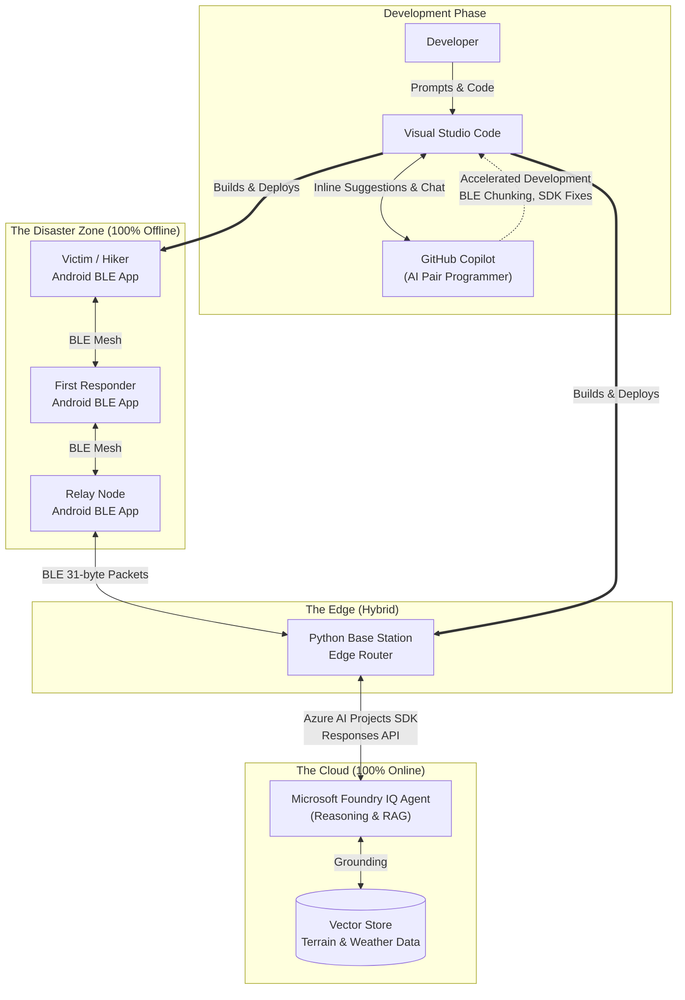

# 🏕️ RescueMesh AI: Offline-First Hybrid Edge Intelligence


RescueMesh AI is an **offline-first disaster response and Search & Rescue (SAR) platform**. We built a custom **Bluetooth Low Energy (BLE) Mesh Network** that allows disconnected Android devices to bounce messages across a disaster zone where cellular infrastructure has failed. 

At the edge of the connectivity zone sits our Python Base Station, acting as a secure bridge. Using the **Microsoft Azure AI Projects SDK**, the Base Station intercepts offline SOS queries, securely proxies them to our custom **Foundry IQ Agent**, and then dynamically chunks the AI's life-saving intelligence back across the offline Bluetooth mesh.

---

## 🏗️ Architecture Diagram



---

## 🧠 How We Used Microsoft Foundry IQ (Required)

We utilized the **Foundry IQ Agent** as the central intelligence layer for our SAR platform. 
1. **Knowledge Grounding:** We uploaded hyper-local disaster intelligence, terrain maps, and extreme weather forecasts as a Vector Store to Azure Foundry.
2. **NextGen Responses API:** Our Python Base Station connects to Azure using the `azure-ai-projects` SDK. When an offline hiker transmits a query like `@IQ canyon`, the Base Station routes this to the Foundry Agent via the `openai_client.responses.create` API, referencing the agent version.
3. **Preventing Hallucination:** Because the agent is completely grounded on our local vector data, it provides deterministic, hallucination-free warnings (e.g., *Flash Flood Watch, 55F, Muddy*) which are critical for survival scenarios.

---

## 🤖 GitHub Copilot & VS Code Journey (Required)

Building an offline BLE mesh that interfaces with cutting-edge Azure Cloud AI presented massive engineering challenges. We relied extensively on **Visual Studio Code** and **GitHub Copilot** to accelerate development, debug complex asynchronous networking, and resolve SDK conflicts.

### Key Issues Faced & How Copilot Solved Them:

#### 1. The 31-Byte BLE Payload Limit
* **The Issue:** Bluetooth Low Energy (BLE) strictly limits Manufacturer Data payloads to ~31 bytes. The Azure AI responses were too long to transmit back to the offline Android phones, causing packet truncation and crashes.
* **The Copilot Solution:** We used Copilot Chat to design a byte-chunking algorithm in Python. Copilot suggested splitting the string into 20-byte arrays and transmitting them sequentially using `asyncio.sleep()` to prevent overwhelming the Android BLE receiver.

#### 2. Android NDK "Ninja" Build Failures
* **The Issue:** While building the Android client, we encountered severe `ninja: error: build.ninja:1: syntax error` failures because the Gradle path exceeded Windows MAX_PATH limits.
* **The Copilot Solution:** Copilot immediately identified the Windows path-length restriction and suggested moving the project to the root directory `C:\Meshmap`, while also generating the exact `ndk.abiFilters` Gradle block to restrict the build to `arm64-v8a`, completely bypassing the compilation crash.

#### 3. Azure Foundry "404 DeploymentNotFound" SDK Error
* **The Issue:** When upgrading to `azure-ai-projects==2.2.0`, the standard OpenAI `create_thread` methods threw attribute errors, and the routing endpoints returned 404s.
* **The Copilot Solution:** By pasting the Azure errors into Copilot Chat, we mapped the new NextGen agent routing architecture. Copilot helped us rewrite the client to use the newly released `responses.create` API with the `agent_reference` extra body, allowing seamless integration with our Foundry Agent.

---

## 🚀 Quick Start (Local Setup)

> ⚠️ **SECURITY NOTICE:** Do not commit your `.env` file! We use a `.gitignore` to protect all API keys and Azure credentials.

1. **Clone the Repository**
   ```bash
   git clone https://github.com/vishalvermauts/RescueMesh-AI.git
   cd RescueMesh-AI
   ```

2. **Configure Environment**
   Create a `.env` file in the root directory:
   ```env
   AZURE_FOUNDRY_ENDPOINT="https://<your-resource>.services.ai.azure.com/api/projects/<project>"
   AZURE_FOUNDRY_AGENT_NAME="Meshmap"
   AZURE_FOUNDRY_AGENT_VERSION="2"
   ```

3. **Run the Base Station**
   ```bash
   pip install azure-ai-projects>=2.1.0 bleak asyncio
   python control_room.py
   ```

4. **Deploy the Android App**
   Open the Android project in Android Studio, ensure Bluetooth/Location permissions are granted, and build to your physical device.
